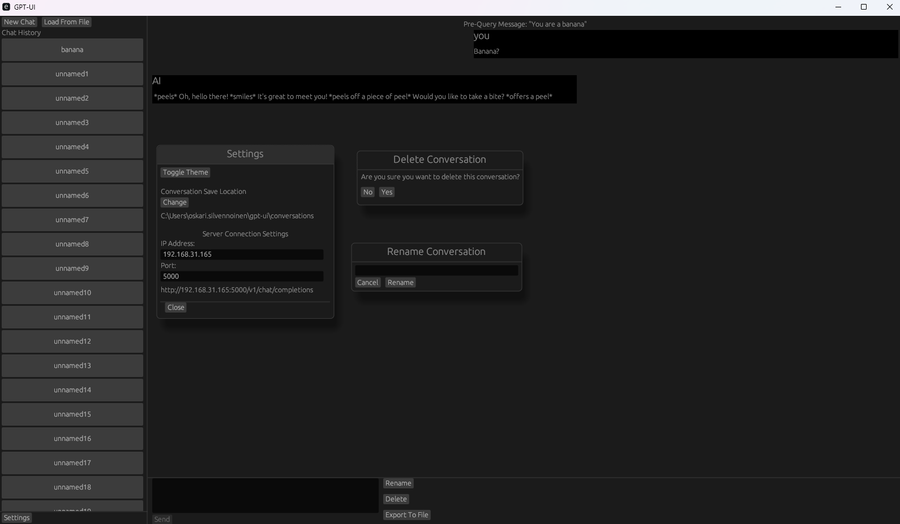

# GPT-UI
An easy to use client GUI for H2OGPT servers. Made by one person in a couple of weeks. 1000+ lines of code with a short story included somewhere in the source code, go find it (it's the past problem one).

## Features
- Multi-threading
  - When sending a message to AI, program will spawn a new thread to wait for the response from AI. Why? So the UI won't freeze. Also, windows gets no response so windows will crash the app.
- Conversations
  - You can can have multiple conversations with the AI.
- Settings
  - Theme toggle (Light, Dark)
  - Conversation save location changing
  - H2OGPT server ip and port changing
- Conversation saving
  - Conversations are saved when you exit the app. So, please don't crash it, or you will lose progress.
- Conversation exporting and loading
  - You can export a conversation to a .json file
  - You can load a conversation from a .json file
- Conversation renaming
  - If you don't like the name "unnamed", you can change it.
- Delete conversations
  - If you want to get rid of your secret conversation 😉, you can delete them.

Screenshot of GPT-UI

## Build from source
### Prerequisites:
- Rust toolkit from https://rustup.rs/
. Contains install command for linux and installer for windows.
- The source code, of course. How'd you think, you could build the source code, without the source code.

### Build
1. Navigate to the GPT-UI directory (The one with a Cargo.toml file and a src/ directory)
2. Run the command "cargo r" WITHOUT THE QUOTATION MARKS. \
Or "cargo r --release" WITHOUT THE QUOTATION MARKS to run it with optimizations.

You can find more cargo commands with the "cargo --help" command.

### Usage
First, you need a [H2OGPT](https://github.com/h2oai/h2ogpt) server to connect to.

Then open the settings and set you settings there. Put your H2OGPT server's ip and port in there.\
Byt defult, the ip address is the loopback address (127.0.0.1).\
If the app cannot connect to a server when sending a message, it will tell you that it failed.

## A Story
Read if bored or something.

I setup a [H2OGPT](https://github.com/h2oai/h2ogpt) app to a virtual server. 
But it's sloooow, really slooooooooow. 
Turns out that the CPU isn't powerful enough, we need a GPU for it to be faster. We didn't have a GPU, and those are EXPENSIVE (about 3k). 
And we didn't know which one to buy, there are many GPUs to choose from. And I can't progress with AI stuff without the GPU.\
So in the mean time, I decided to make this project and learn new stuff. While developing this application, we decided on a GPU and ordered it.\
As of writing this, I'm still waiting for the GPU to arrive so I can do more AI stuff. It's 2024/05/13 10.17 AM.